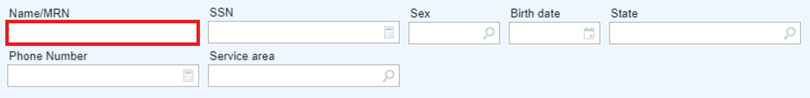

# Why Goose?

Goose is specifically designed for the non-technical user.
It is not a library or an automation platform, it is a complete solution for scripting your own GUI automations with minimal technical training (see below).
It also comes fully featured with highly capable text analysis and computer vision features that allow navigating complex GUI interfaces commonly found in clinical settings.

Some distinctive features of Goose:  
* LLM free text analysis goes beyond simple text search or matching
  * Ex: *Search within free text surgical note to see if the patient had a partial or radical nephrectomy without trying to match on every combination or potential misspelling of `radical`, `partial nephrectomy`, `nephrectomy`, etc.*
* Table transformer computer vision models allow parsing of table-esque GUI constructs
  * Ex: *Looking at the results flowsheet for the patient's HbA1c, select both the most recent and highest values*.

... potentially more to come!

The most critical element, however, is that Goose is *entirely locally run*, does *not* require online access, and *cannot* communicate PHI outside of the desktop environment.
Goose is also a standalone .exe file that does not require installation or admin access, so it can be used in most hospital computing environments.

## How Does Goose Work?
Goose scripts are written in a DSL (domain-specific-language) called "Honk" and are stored in `.honk` files. 
Here is an example of a simple Honk script that checks whether Epic EHR is open and opens a patient based on their MRN:

```
begin: check template<Epic EHR>
click template<chart-review-button>
input template<mrn-text-box> 000289401
```
This script does the following:
1. Checks whether the Epic EHR program is open. It does so by looking at the screen and seeing if the screen matches the user-provided image template called Epic EHR. Goose lets you create image templates easily by clicking and dragging over specific GUI elements so that it knows where to target its clicks and inputs.
2. Clicks the chart review button, a component that looks like this:  
3. Inputs the MRN into the appropriate text field, here: 

While this is a basic example to demonstrate the concept, with some learning, a user can design highly complex and capable automated workflows that can understand free text, parse through tables and navigate through dynamic interfaces.